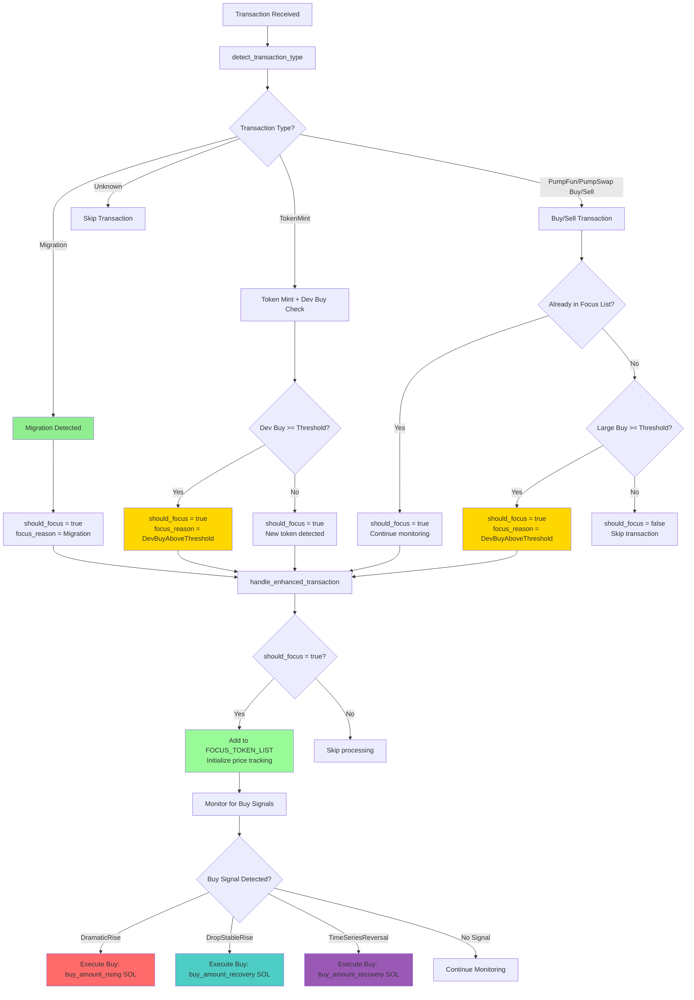
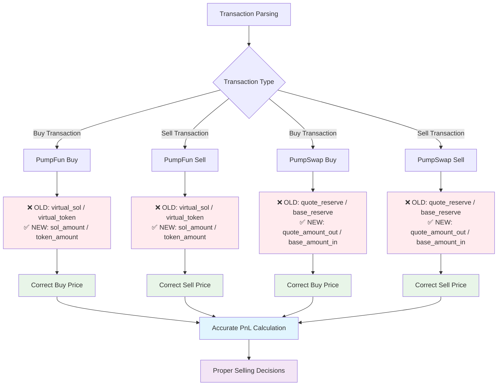
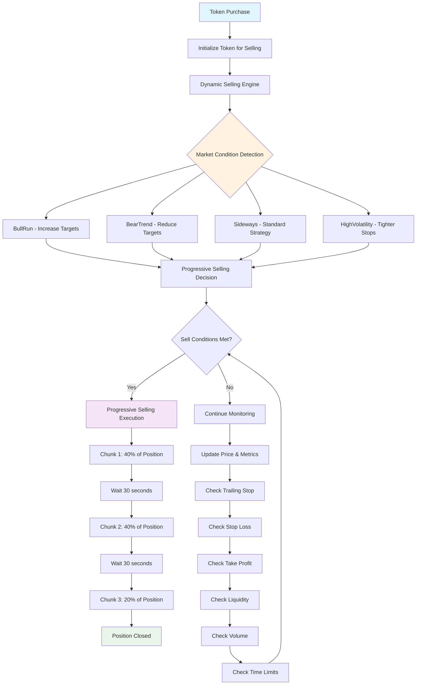

# Solana Copy Trading Bot (Fast Copy Trading in 0 Block)

## Overview

Solana Copy Trading Bot with high speed and good selling logic. Use nozomi, zeroslot, bloxroute, jito, telegram notification, yellowstone grpc, no rpc, shred stream.

## Recent Update
Updated pumpdotfun and pump amm swap's instructions according to recent pumpfun smart contract upgrade

## Example Transactions
### PumpDotFun Copy Trading Transactions(0 Block)
Target Address: https://solscan.io/account/suqh5sHtr8HyJ7q8scBimULPkPpA557prMG47xCHQfK#defiactivities (Top Trader with 80-90% Win Rate)

Bot Wallet: https://solscan.io/account/8io2kFbfUsGpggVknDkWQdeHyTHR5HL4dFfnTHxNwSfo#defiactivities

- Source Transaction(BUY):
https://solscan.io/tx/5E3M4nmPJiitSX7KgyiSJ2fhc62NCoFCbc8w5muG1c4HKhUWVgtARL1Hz29LwzP7WSf52FGkJ2GSkKTsoq7s3ACH

- Copied Transaction(BUY):
https://solscan.io/tx/2hS7u22TX2RqyDt96m5SEPEB4Va9HJwz6wzoCw1Ru8jWpiz8NLc57DGPfxAfU38MuZQe2DpZKqn4DWsxK3uXVbTa

- Source Transaction(SELL):
https://solscan.io/tx/i8sNjNShZbU8yHjvVU9UPzyvYQqSgXoeFzYmFjdR12Fd1MYHrPCnDwNxyK6jcTiqpi2Ya4JsjzziwuDMj6HNZCX

- Copied Transaction(SELL):
https://solscan.io/tx/3fvcP6jQvo6dGiwAPZqp5hJThbjzeKU3NMeBmoPvksYX4VPUyPpdr5iyfmHn2b1HbtyydQNudnHEGJvEt7VPNcXe

### Pump Amm Swap Copy Trading Transactions (1 Block)
- Source
https://solscan.io/tx/4XTpA4h3j3j7VTMmMg7LzwuoftUjvrfbLUgzPRtxbLYeSMPtgUdWUELrPAdY2YCStEuC2jdZiox85g9c9bfdPBS4

- Copied
https://solscan.io/tx/3GxVKyjeYV2B6gfJPpFMdBsAkSeeuPd8mcVqTC8dBWvUms6f1CgTLxJhwVE4gJ6zeZp6chvbbAvHEhYY1MKTAygG

## Unique Feature: Racing Transaction Confirm
Send Transactions to multiple tx confim providers like jito, nextBlock, BloxRoute, Temporal at the same time. And only confirm the fastest one. So always provide the fastest tx confirming.

## Core Features

- **Target Wallet List**: Easily add and manage a list of target wallets for trading replication.
  
- **Multi-DEX Support**: Compatible with various decentralized exchanges, including Jupiter, Raydium, and PumpFun Swap. Plans to integrate Meteora Swap are underway.
  
- **Instant Transaction Replication**: The bot monitors target wallets' activities in real-time to facilitate immediate transaction copying.
  
- **Geyser Usage**: Available to use Helius or yellowstone Geyser. (Yellowstone is faster)

- **Manual Sell**: Able to manually sell if you wanna sell it any time

```mermaid
**flowchart TD
    A[Yellowstone gRPC] --> B[Target Wallet Transaction]
    B --> C{Transaction Type}
    
    C -->|Buy| D[handle_parsed_data_for_buying]
    C -->|Sell| E[handle_parsed_data_for_selling]
    
    D --> F{Safety Checks}
    F -->|Pass| G[execute_buy]
    F -->|Fail| H[Skip]
    
    G --> I[setup_selling_strategy]
    I --> J[monitor_token_for_selling]
    
    E --> K{IS_COPY_SELLING?}
    K -->|Yes| L{We Own Token?}
    K -->|No| M[Skip]
    
    L -->|Yes| N[execute_sell]
    L -->|No| O[Skip]
    
    J --> P[SellingEngine.evaluate_conditions]
    P --> Q{Sell Trigger?}
    Q -->|Yes| R[Execute Sell Strategy]
    Q -->|No| S[Continue Monitoring]
    
    R --> T[Progressive/Emergency Sell]
    N --> U[Copy Sell]
    
    T --> V[Cancel Monitoring]
    U --> V**
```







## Installation

To set up the Solana PumpFun Sniper Bot, please follow these instructions:

1. **Clone the Repository**:
   ```bash
   git clone https://github.com/coffellas-cto/solana-rust-pumpfun-pumpswap-raydium-copy-sniper-trading-bot.git
   cd solana-rust-ts-pumpfun-pumpswap-raydium-copy-trading-bot

## Support

For assistance or inquiries, please reach out via Telegram at https://t.me/coffellas
